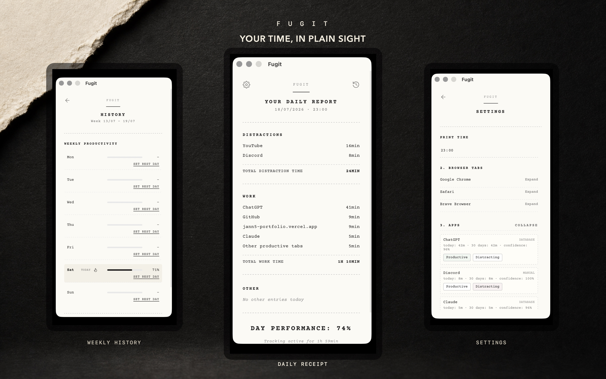

# Fugit

> A private, native macOS menu-bar app for seeing where your time went.

Fugit tracks active-app time locally and turns a day into a clear productivity receipt: focused time, distractions, neutral apps, and a weekly trend. It does not require an account or cloud sync.

[**Download the latest macOS release**](https://github.com/jann5/fugit/releases/latest)

## What it does

- tracks the active macOS application in short intervals;
- groups activity into productive, distracting, and neutral categories;
- shows a readable daily receipt and weekly trend;
- stores data locally, without an account or server sync;
- provides a lightweight menu-bar experience instead of another full-screen dashboard.

## Install

1. Open [Releases](https://github.com/jann5/fugit/releases/latest).
2. Download <code>Fugit.dmg</code> or <code>Fugit.zip</code> for your Mac.
3. Move <strong>Fugit.app</strong> to Applications and grant the requested Accessibility / System Events permissions on first launch.

### Terminal install (optional)

The installer downloads the ZIP from the latest GitHub Release, verifies the app bundle signature, installs it into <code>~/Applications</code>, and leaves existing Fugit data untouched.

~~~bash
curl -fsSLO https://raw.githubusercontent.com/jann5/fugit/main/scripts/install-fugit-macos.sh
bash install-fugit-macos.sh
~~~

## Compatibility

- macOS 10.15 or newer
- Intel (<code>x86_64</code>) and Apple Silicon (<code>arm64</code>)

## Privacy

Fugit keeps its application data locally in:

~~~text
~/Library/Application Support/com.jannawrot.fugit/
~~~

Typical files include settings, daily statistics, and rest-day data. The app has no user account and no cloud synchronisation.

## Develop locally

Requirements: Node.js 18+, npm, and Rust through <code>rustup</code>.

~~~bash
npm install
npm run tauri dev
~~~

Useful commands:

~~~bash
npm run build
npm run tauri build
npm run build:zip
npm run build:dmg
~~~

## Stack

- React and TypeScript
- Vite
- Rust
- Tauri 2

## Release workflow

Release builds are published through [GitHub Releases](https://github.com/jann5/fugit/releases), so each version has a stable download page and versioned assets.
